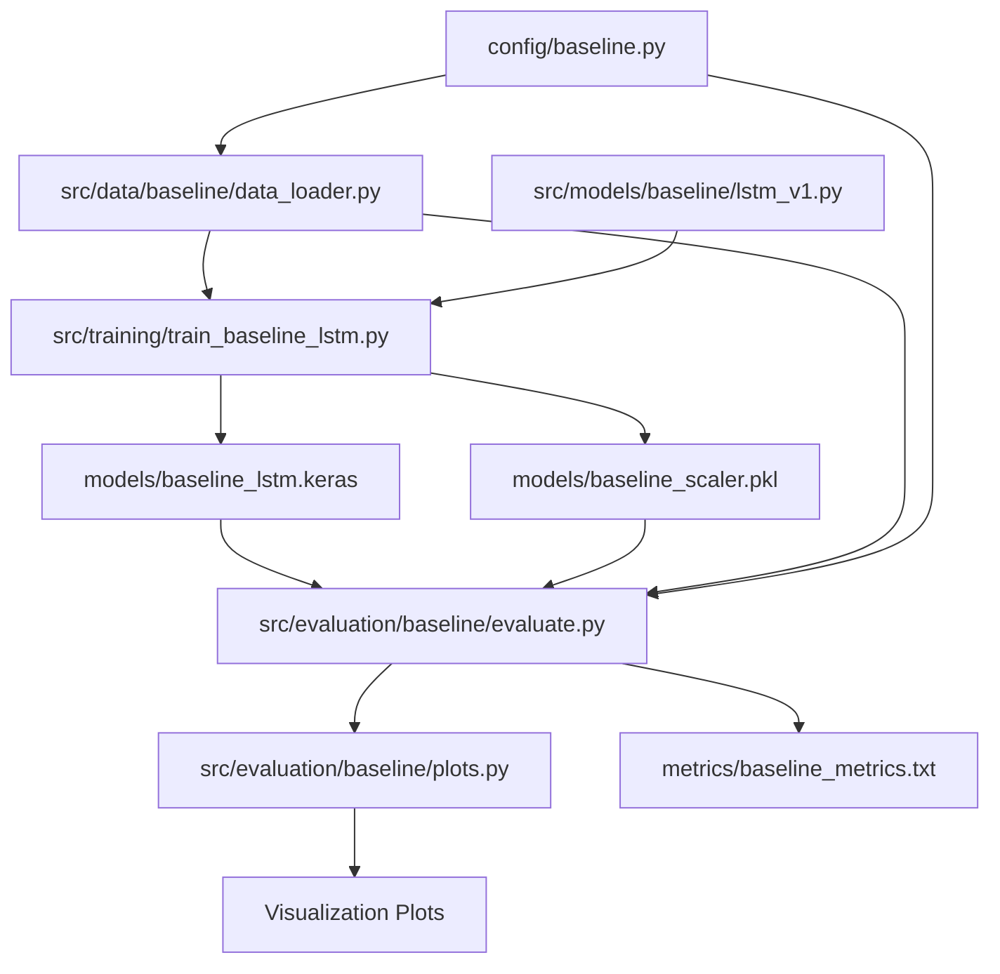
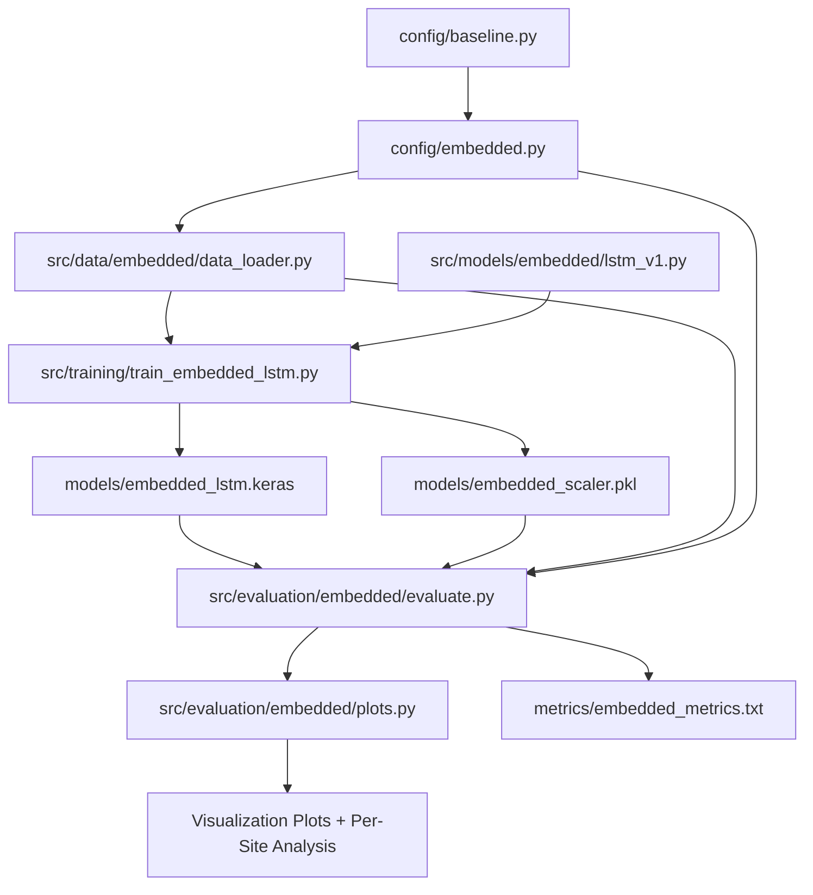
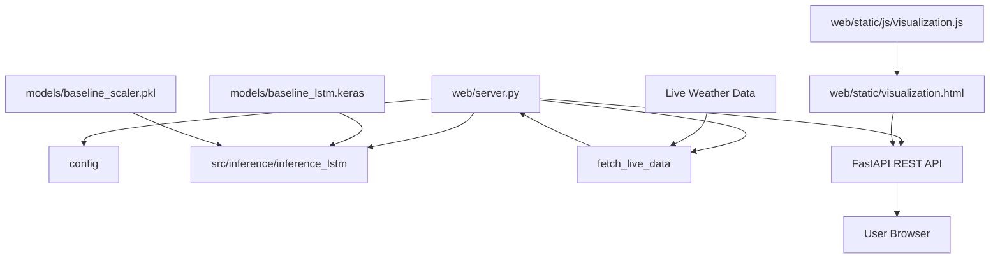

# Repository Import Graph
## Visual Dependency Map - Solar Power Forecasting

This file provides a visual representation of how modules import and depend on each other.

---

## 🎯 Dependency Layers (Top to Bottom)

```
┌─────────────────────────────────────────────────────────────┐
│                    CONFIGURATION LAYER                       │
│  config/baseline.py  ←──────────  config/embedded.py        │
│  (pure config)                    (imports FEATURE_COLS)    │
└─────────────────────────────────────────────────────────────┘
                            ↓
┌─────────────────────────────────────────────────────────────┐
│                        DATA LAYER                            │
│                                                              │
│  src/data/baseline/data_loader.py    src/data/embedded/     │
│      ↑ imports config.baseline          data_loader.py      │
│                                         ↑ imports config.    │
│                                           embedded           │
└─────────────────────────────────────────────────────────────┘
                            ↓
┌─────────────────────────────────────────────────────────────┐
│                     MODEL ARCHITECTURE LAYER                 │
│                                                              │
│  src/models/baseline/lstm_v1.py    src/models/embedded/     │
│      (TensorFlow/Keras)             lstm_v1.py              │
│                                     (TensorFlow/Keras)      │
│                                                              │
│  src/models/xgboost/model_v1.py                             │
│      (XGBoost)                                              │
└─────────────────────────────────────────────────────────────┘
                            ↓
┌─────────────────────────────────────────────────────────────┐
│                      TRAINING LAYER                          │
│                                                              │
│  src/training/train_baseline_lstm.py                        │
│      imports: config.baseline, data.baseline.data_loader,   │
│               models.baseline.lstm                          │
│                                                              │
│  src/training/train_embedded_lstm.py                        │
│      imports: config.embedded, data.embedded.data_loader,   │
│               models.embedded.lstm                          │
│                                                              │
│  src/training/train_xgboost.py                              │
│      imports: config.baseline, models.xgboost.*             │
└─────────────────────────────────────────────────────────────┘
                            ↓
┌─────────────────────────────────────────────────────────────┐
│                     EVALUATION LAYER                         │
│                                                              │
│  src/evaluation/baseline/evaluate.py                        │
│      imports: config.baseline, data.baseline.data_loader    │
│                                                              │
│  src/evaluation/baseline/plots.py                           │
│      (visualization, no project imports)                    │
│                                                              │
│  src/evaluation/embedded/evaluate.py                        │
│      imports: config.embedded, data.embedded.data_loader    │
│                                                              │
│  src/evaluation/embedded/plots.py                           │
│      (visualization, no project imports)                    │
│                                                              │
│  src/evaluation/comparison/compare_models.py                │
│      imports: evaluation.baseline.evaluate,                 │
│               evaluation.embedded.evaluate                  │
└─────────────────────────────────────────────────────────────┘
                            ↓
┌─────────────────────────────────────────────────────────────┐
│                    INFERENCE LAYER                           │
│                                                              │
│  src/inference/baseline/predict.py                          │
│  src/inference/embedded/inference_embedded.py               │
│  src/inference/inference_xgb.py                             │
└─────────────────────────────────────────────────────────────┘
                            ↓
┌─────────────────────────────────────────────────────────────┐
│                   WEB APPLICATION LAYER                      │
│                                                              │
│  web/server.py                                              │
│      imports: config, src.inference.inference_lstm,         │
│               fetch_live_data                               │
│                                                              │
│  web/main.py                                                │
│      imports: config, src.models.lstm_baseline,             │
│               src.inference.inference_lstm,                 │
│               fetch_live_data                               │
└─────────────────────────────────────────────────────────────┘
```

---

## 📋 Detailed Import Matrix

### Module → Dependencies

| File | Imports From Project | Imports External |
|------|---------------------|------------------|
| **config/baseline.py** | None | None |
| **config/embedded.py** | config.baseline | None |
| **src/data/baseline/data_loader.py** | config.baseline | pandas, numpy, sklearn, pickle |
| **src/data/embedded/data_loader.py** | config.embedded | pandas, numpy, sklearn, pickle, glob |
| **src/models/baseline/lstm_v1.py** | None | tensorflow.keras |
| **src/models/embedded/lstm_v1.py** | None | tensorflow.keras |
| **src/models/xgboost/model_v1.py** | None | xgboost |
| **src/models/xgboost/data.py** | None | pandas, numpy |
| **src/training/train_baseline_lstm.py** | config.baseline<br>src.data.baseline.data_loader<br>src.models.baseline.lstm<br>src.evaluation.baseline.* | numpy, tensorflow, sys, os |
| **src/training/train_embedded_lstm.py** | config.embedded<br>src.data.embedded.data_loader<br>src.models.embedded.lstm<br>src.evaluation.embedded.* | numpy, tensorflow, sys, os |
| **src/training/train_xgboost.py** | config.baseline<br>src.models.xgboost.model<br>src.models.xgboost.data | numpy, sys |
| **src/evaluation/baseline/evaluate.py** | config.baseline<br>src.data.baseline.data_loader | tensorflow, numpy, pickle |
| **src/evaluation/baseline/plots.py** | None | matplotlib, numpy |
| **src/evaluation/embedded/evaluate.py** | config.embedded<br>src.data.embedded.data_loader | tensorflow, numpy, pickle |
| **src/evaluation/embedded/plots.py** | None | matplotlib, numpy |
| **src/evaluation/comparison/compare_models.py** | src.evaluation.baseline.evaluate<br>src.evaluation.embedded.evaluate | None |
| **web/server.py** | config<br>src.inference.inference_lstm<br>fetch_live_data | fastapi, pandas, os, math |
| **web/main.py** | config<br>src.models.lstm_baseline<br>src.inference.inference_lstm<br>fetch_live_data | argparse, sys |

---

## 🔄 Circular Dependency Check

✅ **No circular dependencies detected**

All dependencies flow in one direction:
```
Config → Data → Models → Training → Evaluation → Inference → Web
```

---

## 📊 Import Frequency (Which files are most imported?)

1. **config/baseline.py** - 5 imports
   - config.embedded.py
   - src.data.baseline.data_loader.py
   - src.training.train_baseline_lstm.py
   - src.training.train_xgboost.py
   - src.evaluation.baseline.evaluate.py

2. **config/embedded.py** - 3 imports
   - src.data.embedded.data_loader.py
   - src.training.train_embedded_lstm.py
   - src.evaluation.embedded.evaluate.py

3. **src.data.baseline.data_loader** - 2 imports
   - src.training.train_baseline_lstm.py
   - src.evaluation.baseline.evaluate.py

4. **src.data.embedded.data_loader** - 2 imports
   - src.training.train_embedded_lstm.py
   - src.evaluation.embedded.evaluate.py

5. **src.evaluation.*.evaluate** modules - 1 import each
   - src.evaluation.comparison.compare_models.py

---

## 🎨 Visual Dependency Graph (Baseline Pipeline)



---

## 🎨 Visual Dependency Graph (Embedded Pipeline)



---

## 🎨 Visual Dependency Graph (Web Application)



---

## 🔍 Cross-Reference: Which File References Where

### config/baseline.py is referenced in:
- `config/embedded.py` (line 44: `from config.baseline import FEATURE_COLS_BASELINE`)
- `src/data/baseline/data_loader.py` (imports FEATURE_COLS_BASELINE)
- `src/training/train_baseline_lstm.py` (lines 20-32: imports all config values)
- `src/evaluation/baseline/evaluate.py` (imports config values)
- `src/training/train_xgboost.py` (line 8: imports DATA_FILE, TEST_SPLIT)

### config/embedded.py is referenced in:
- `src/data/embedded/data_loader.py` (imports all config values)
- `src/training/train_embedded_lstm.py` (lines 20-38: imports all config values)
- `src/evaluation/embedded/evaluate.py` (imports config values)

### src/data/baseline/data_loader.py is referenced in:
- `src/training/train_baseline_lstm.py` (lines 34-37: imports load_single_site_csv, preprocess_baseline_data)
- `src/evaluation/baseline/evaluate.py` (imports same functions)

### src/data/embedded/data_loader.py is referenced in:
- `src/training/train_embedded_lstm.py` (line 40: imports preprocess_embedded_data)
- `src/evaluation/embedded/evaluate.py` (imports same function)

### src/models/baseline/lstm.py is referenced in:
- `src/training/train_baseline_lstm.py` (line 39: imports build_baseline_lstm)

### src/models/embedded/lstm.py is referenced in:
- `src/training/train_embedded_lstm.py` (line 41: imports build_embedded_lstm)

### src/models/xgboost/model.py is referenced in:
- `src/training/train_xgboost.py` (line 9: imports build_xgboost_model)

### src/models/xgboost/data.py is referenced in:
- `src/training/train_xgboost.py` (line 10: imports prepare_xgboost_data)

### src/evaluation/baseline/evaluate.py is referenced in:
- `src/training/train_baseline_lstm.py` (line 18: imports evaluate_baseline)
- `src/evaluation/comparison/compare_models.py` (imports for comparison)

### src/evaluation/baseline/plots.py is referenced in:
- `src/training/train_baseline_lstm.py` (lines 13-16: imports plotting functions)

### src/evaluation/embedded/evaluate.py is referenced in:
- `src/training/train_embedded_lstm.py` (line 12: imports evaluate_embedded)
- `src/evaluation/comparison/compare_models.py` (imports for comparison)

### src/evaluation/embedded/plots.py is referenced in:
- `src/training/train_embedded_lstm.py` (lines 13-17: imports plotting functions)

### fetch_live_data.py is referenced in:
- `web/server.py` (line 8: imports prepare_live_sequence)
- `web/main.py` (line 6: imports prepare_live_sequence)

---

## 📦 External Dependencies by Layer

### Configuration Layer
- No external dependencies

### Data Layer
- `pandas` - dataframe operations
- `numpy` - numerical operations
- `sklearn.preprocessing.MinMaxScaler` - feature scaling
- `pickle` - scaler serialization
- `glob` - file pattern matching

### Model Layer
- `tensorflow.keras` - deep learning framework
- `xgboost` - gradient boosting

### Training Layer
- All data + model layer dependencies
- `tensorflow.keras.callbacks` - EarlyStopping, ModelCheckpoint

### Evaluation Layer
- `matplotlib.pyplot` - visualization
- `numpy` - metrics calculation

### Inference Layer
- `tensorflow` - model loading
- `pickle` - scaler loading

### Web Layer
- `fastapi` - web framework
- `pandas` - data handling
- `math` - calculations
- `argparse` - CLI

---

## 🚀 Entry Point Analysis

### Direct Entry Points (can be run standalone):
1. `src/training/train_baseline_lstm.py` (if __name__ == "__main__")
2. `src/training/train_embedded_lstm.py` (if __name__ == "__main__")
3. `src/training/train_xgboost.py` (if __name__ == "__main__")
4. `web/server.py`
5. `web/main.py`
6. `src/optimization/optuna_lstm.py`
7. `src/evaluation/comparison/compare_models.py`

### Library Modules (imported by others):
- All `config/` files
- All `src/data/` files
- All `src/models/` files
- All `src/evaluation/*/evaluate.py` and `plots.py` files

---

*This import graph is designed to help LLMs understand the dependency structure and identify which modules need to be loaded/understood for any given task.*
